# Adizon Architecture

## Übersicht

Adizon ist ein AI-gestützter CRM-Assistent, der über Chat-Plattformen (Telegram, Slack) erreichbar ist. Das System verwendet LangGraph für die Workflow-Orchestrierung und unterstützt verschiedene CRM-Backends (Twenty CRM, Zoho CRM).

---

## Request Flow Diagramm

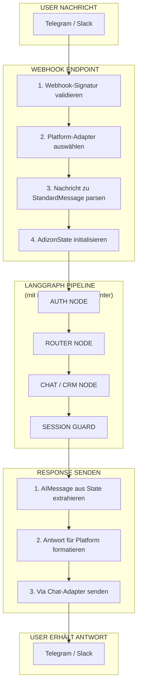

---

## Detaillierter Node-Flow

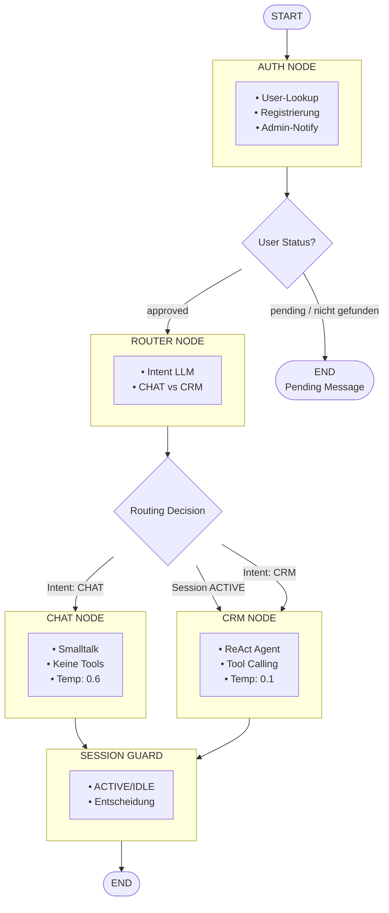

---

## Komponenten-Architektur

### 1. Entry Point (server.py)

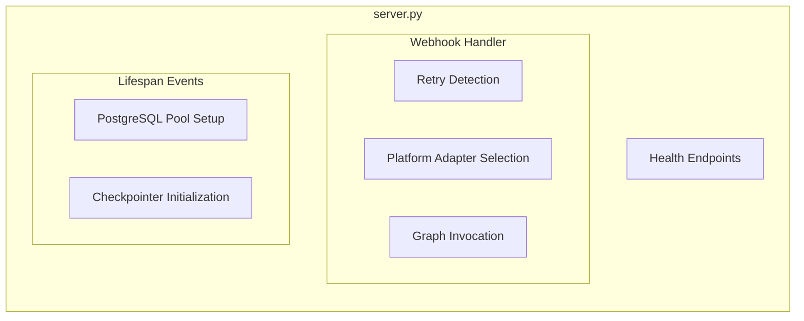

**Schlüsselfunktionen:**
- Webhook-Empfang und Validierung
- Async Message Processing
- State Persistierung via LangGraph Checkpointer

### 2. LangGraph Pipeline (graph/)

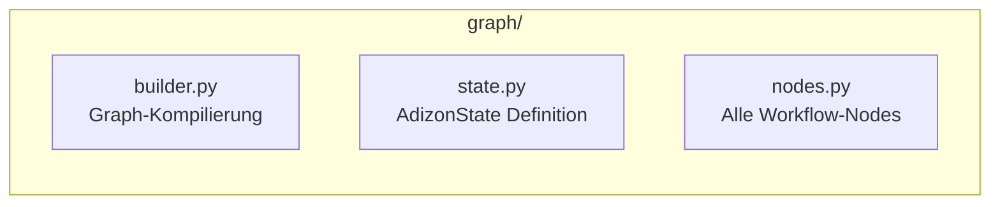

**AdizonState Schema:**
```python
AdizonState = {
    "messages": list[BaseMessage],      # Konversationshistorie
    "user": Optional[dict],             # Authentifizierter User
    "user_id": str,                     # Platform-ID (z.B. "telegram:123456")
    "platform": str,                    # "telegram" oder "slack"
    "chat_id": str,                     # Für Antworten
    "session_state": "ACTIVE" | "IDLE", # Session-Modus
    "dialog_state": dict,               # Tool-Kontext
    "last_action_context": dict         # Undo-Tracking
}
```

### 3. Node-Beschreibungen

| Node | Zweck | Konfiguration |
|------|-------|---------------|
| **Auth** | User-Authentifizierung & Registrierung | - |
| **Router** | Intent-Klassifikation (CHAT/CRM) | `prompts/intent_detection.yaml` |
| **Chat** | Einfache Konversation ohne Tools | `prompts/chat_handler.yaml` |
| **CRM** | Business-Logik mit ReAct Agent | `prompts/crm_handler.yaml` |
| **Session Guard** | ACTIVE/IDLE Entscheidung | `prompts/session_guard.yaml` |

### 4. CRM Tools (tools/crm/)

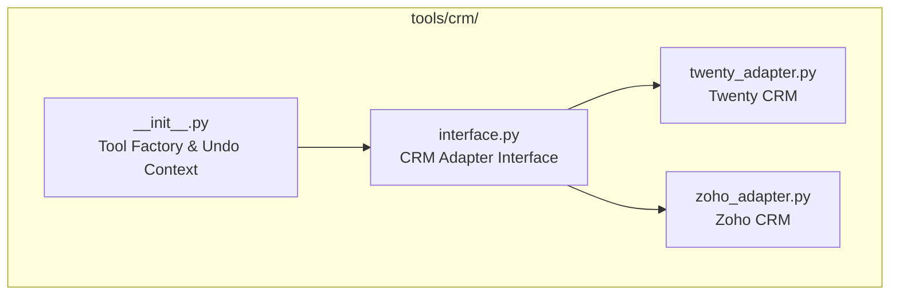

**Verfügbare Tools:**
| Tool | Funktion |
|------|----------|
| `search_contacts` | Volltextsuche nach Personen/Firmen |
| `create_contact` | Lead/Person erstellen |
| `create_task` | Aufgabe mit Attribution erstellen |
| `create_note` | Notiz mit Attribution erstellen |
| `undo_last_action` | Letzte Aktion rückgängig machen |
| `update_entity` | Kontaktfelder aktualisieren |
| `get_contact_details` | Alle Felder eines Kontakts abrufen |

### 5. Chat Adapters (tools/chat/)

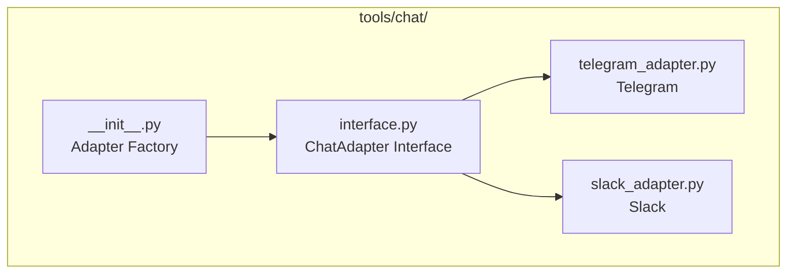

**StandardMessage Format:**
```python
StandardMessage = {
    "user_id": str,      # "telegram:123456"
    "user_name": str,    # Display Name
    "text": str,         # Nachrichteninhalt
    "platform": str,     # "telegram" oder "slack"
    "chat_id": str,      # Für Antworten
    "raw_data": dict     # Original Webhook
}
```

### 6. Datenbank Layer

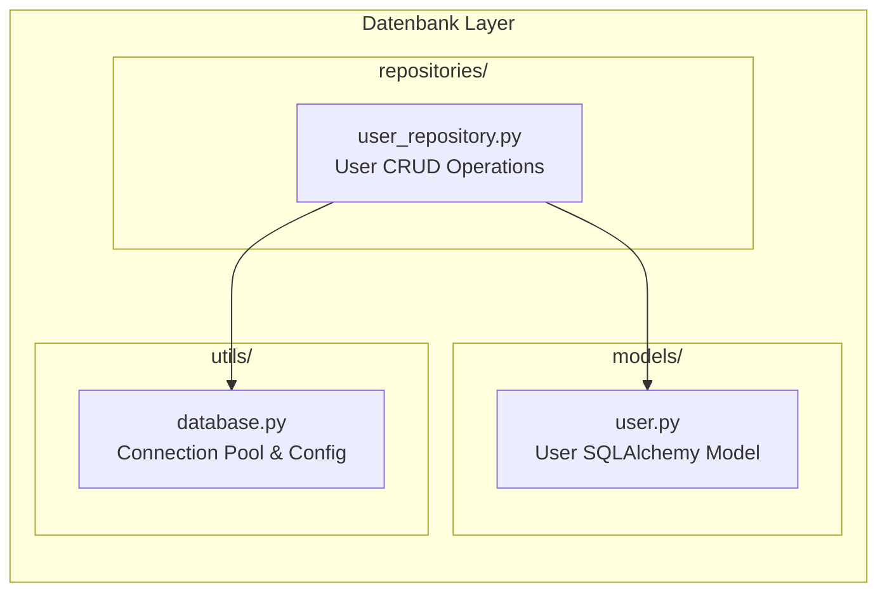

**User Model:**
```python
User = {
    "id": UUID,
    "email": str,
    "name": str,
    "telegram_id": str,      # Optional
    "slack_id": str,         # Optional
    "is_active": bool,
    "is_approved": bool,     # Muss approved sein
    "role": "ADMIN" | "USER",
    "crm_display_name": str  # Attribution im CRM
}
```

### 7. Admin API (api/)

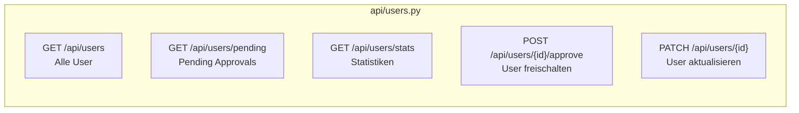

### 8. Frontend (frontend/)

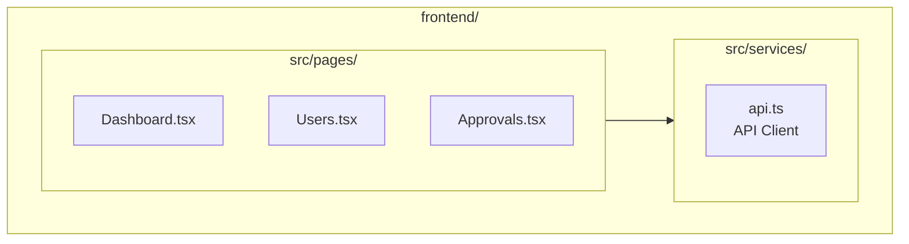

---

## Datenfluss-Zusammenfassung

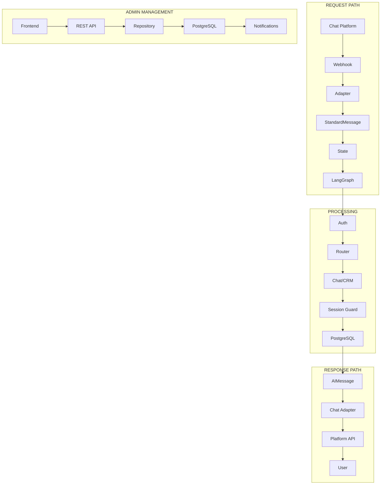

---

## Session Management

### Killswitch & Session Timeout

```mermaid
flowchart TD
    MSG[Incoming Message] --> KILL{Text == "RESTART"?}

    KILL -->|Ja| CLEAR[Session löschen<br/>Checkpoint + Timestamp]
    CLEAR --> RESPONSE1["Alles klar! Mein Gedächtnis<br/>ist gelöscht..."]
    RESPONSE1 --> END1([Ende])

    KILL -->|Nein| TIMEOUT{Session > 15 Min?}

    TIMEOUT -->|Ja| EXPIRE[Session automatisch löschen]
    EXPIRE --> CONTINUE[Weiter zu Graph]

    TIMEOUT -->|Nein| UPDATE[Timestamp aktualisieren]
    UPDATE --> CONTINUE

    CONTINUE --> GRAPH[LangGraph Pipeline]
```

| Feature | Wert | Beschreibung |
|---------|------|--------------|
| **Killswitch** | `RESTART` | Löscht komplette Session (Messages + State) |
| **Timeout** | 15 Minuten | Automatischer Reset bei Inaktivität |
| **Response** | Standardnachricht | "Alles klar! Mein Gedächtnis ist gelöscht..." |

### Sticky Sessions (ACTIVE Mode)

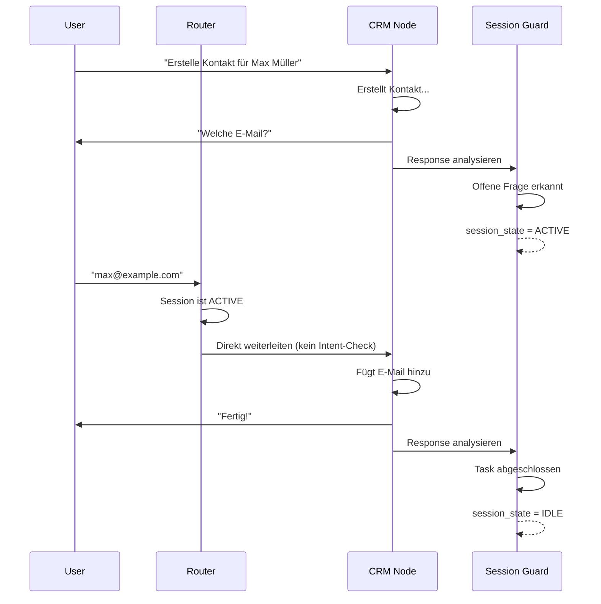

---

## Architektur-Patterns

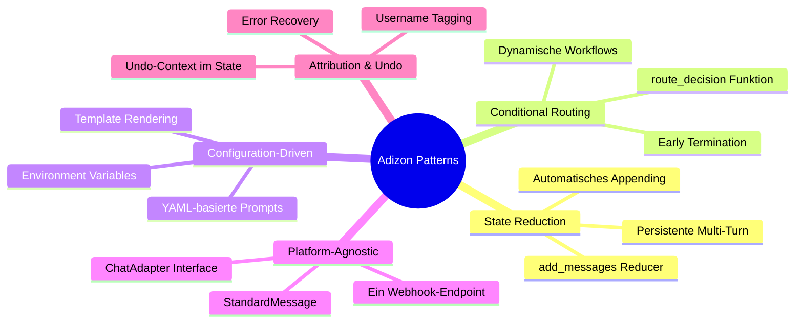

---

## Deployment

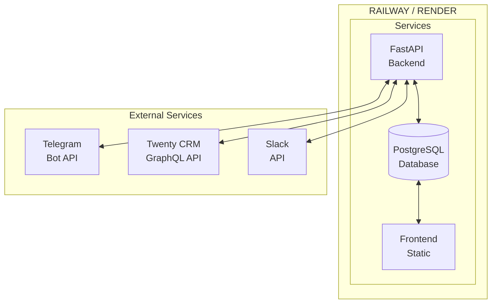

---

## ReAct Agent Loop (CRM Node)

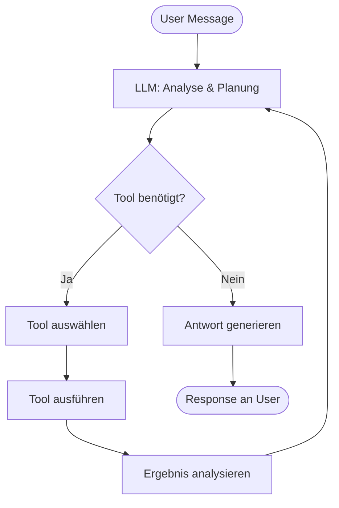

---

## Wichtige Dateien

| Datei | Funktion | Zeilen |
|-------|----------|--------|
| `server.py` | FastAPI Server, Webhooks | ~275 |
| `graph/builder.py` | LangGraph Kompilierung | ~126 |
| `graph/state.py` | State Schema | ~54 |
| `graph/nodes.py` | Alle Workflow Nodes | ~401 |
| `models/user.py` | User Datenbank Model | ~102 |
| `repositories/user_repository.py` | User CRUD | ~265 |
| `tools/crm/__init__.py` | CRM Tools Factory | ~338 |
| `tools/chat/interface.py` | Chat Adapter Interface | ~134 |
| `prompts/*.yaml` | Agent Konfigurationen | 4 Dateien |
