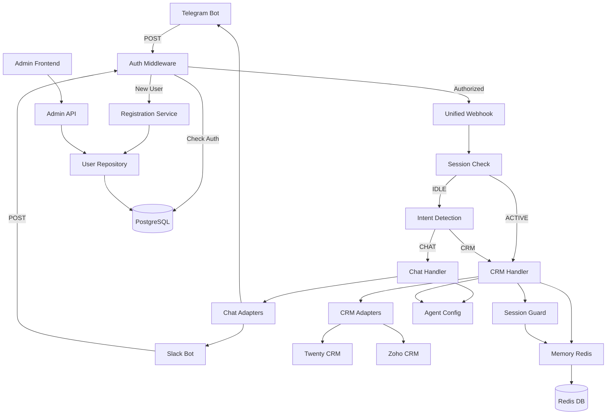

# Adizon V2 - Architektur-Übersicht

## Überblick
Adizon V2 ist ein Multi-Plattform AI-Assistent für KMUs, der Chat-Plattformen (Telegram, Slack) mit CRM-Systemen (Twenty, Zoho) verbindet. Die Architektur folgt einem modularen Adapter-Pattern.

## Architektur-Übersicht (ASCII)

```
┌─────────────────────────────────────────────────────────────────────────┐
│                         EXTERNE SYSTEME                                  │
│  ┌──────────┐  ┌──────────┐  ┌──────────┐  ┌──────────┐  ┌──────────┐ │
│  │ Telegram │  │  Slack   │  │ MS Teams │  │ Twenty   │  │  Zoho    │ │
│  │   Bot    │  │   Bot    │  │ (Future) │  │   CRM    │  │  CRM     │ │
│  └────┬─────┘  └────┬─────┘  └────┬─────┘  └────▲─────┘  └────▲─────┘ │
└───────┼─────────────┼─────────────┼──────────────┼──────────────┼───────┘
        │             │             │              │              │
        │ POST        │ POST        │ POST         │              │
        └─────────────┴─────────────┴──────────────┼──────────────┼────┐
                                                   │              │    │
┌───────────────────────────────────────────────────┼──────────────┼────┘
│                    FASTAPI SERVER (main.py)       │              │     
│  ┌─────────────────────────────────────────┐     │              │     
│  │       Auth Middleware (NEW!)            │     │              │     
│  │  • Extract Platform + User ID           │     │              │     
│  │  • Check PostgreSQL: Authorized?        │     │              │     
│  │  • Inject request.state.user            │     │              │     
│  └───────────────┬─────────────────────────┘     │              │     
│                  │                               │              │     
│  ┌───────────────▼─────────────────────────┐     │              │     
│  │    /webhook/{platform} Endpoint         │     │              │     
│  │  • Registration Flow (new users)        │     │              │     
│  │  • Approval Check (pending users)       │     │              │     
│  └───────────────┬─────────────────────────┘     │              │     
│                  │ [AUTHORIZED ONLY]             │              │     
│  ┌───────────────▼─────────────────────────┐     │              │     
│  │         Message Handler                 │     │              │     
│  └───────────────┬─────────────────────────┘     │              │     
│                  │                               │              │     
│  ┌───────────────▼─────────────────────────┐     │              │     
│  │      Session State Check (Redis)        │     │              │     
│  └────┬─────────────────────────────────┬──┘     │              │     
│       │ IDLE                            │ACTIVE  │              │     
│  ┌────▼──────────┐                 ┌────▼────┐   │              │     
│  │    Intent     │                 │   Skip  │   │              │     
│  │   Detection   │                 │  Router │   │              │     
│  └────┬──────────┘                 └────┬────┘   │              │     
│       │                                 │        │              │     
│   ┌───┴────┬─────────────────────────────┘        │              │     
└───┼────────┼──────────────────────────────────────┼──────────────┼────┘
    │ CHAT   │ CRM                                  │              │     
┌───┴────┐ ┌─▼────────────────────────────────────┐ │              │     
│  Chat  │ │          CRM Handler                 │ │              │     
│ Handler│ │   (LangChain Agent + Tools)          │ │              │     
└───┬────┘ └─┬─────────────────┬──────────────────┘ │              │     
    │        │                 │                    │              │     
    │    ┌───▼────────┐   ┌────▼─────────────────┐  │              │     
    │    │  Session   │   │    CRM Tools         │  │              │     
    │    │   Guard    │   └────┬─────────────────┘  │              │     
    │    └───┬────────┘        │                    │              │     
    └────────┴─────────────────┼────────────────────┼──────────────┼────┐
                               │                    │              │    │
┌──────────────────────────────┼────────────────────┼──────────────┼────┘
│                TOOLS LAYER   │                    │              │     
│  ┌───────────────────────────▼──────────┐  ┌──────▼──────────────▼───┐
│  │      Chat Adapters                   │  │    CRM Adapters         │
│  │  ┌──────────────┐  ┌──────────────┐  │  │  ┌────────┐  ┌────────┐│
│  │  │  Telegram    │  │    Slack     │  │  │  │ Twenty │  │  Zoho  ││
│  │  │   Adapter    │  │   Adapter    │  │  │  │Adapter │  │ Adapter││
│  │  └──────────────┘  └──────────────┘  │  │  └───┬────┘  └───┬────┘│
│  │  ┌──────────────────────────────────┐│  │  ┌───▼────────────▼────┐│
│  │  │ Chat Interface: StandardMessage  ││  │  │  Field Mapping      ││
│  │  └──────────────────────────────────┘│  │  │  Loader (YAML)      ││
│  └───────────────────────────────────────┘  └───┴────────────────────┘│
└─────────────────────────────────────────────────────────────────────────┘
                               │                                          
┌──────────────────────────────┼──────────────────────────────────────────┐
│                 DATA LAYER   │                                          │
│  ┌───────────────────────────▼────────────────────────────────────────┐│
│  │                PostgreSQL Database (NEW!)                          ││
│  │  • users (Auth & User Management)                                  ││
│  │  • Alembic Migrations                                              ││
│  └───────────────────────────────────────────────────────────────────┘│
│  ┌───────────────────────────────────────────────────────────────────┐│
│  │                    Redis Database                                 ││
│  │           • TTL Management  • Deduplication  • Caching            ││
│  │           • Conversation History  • Session State                 ││
│  └───────────────────────────────────────────────────────────────────┘│
└─────────────────────────────────────────────────────────────────────────┘
                               │                                          
┌──────────────────────────────┼──────────────────────────────────────────┐
│                 UTILS LAYER  │                                          │
│  ┌───────────────────────────▼────────────────────────────────────────┐│
│  │  Memory System (Redis)           Agent Config (YAML Loader)        ││
│  │  • Conversation History           • System Prompts                 ││
│  │  • Session State (ACTIVE/IDLE)    • Model Settings                 ││
│  │  • Undo Context                   • LLM Parameters                 ││
│  └───────────────────────────────────────────────────────────────────┘│
│  ┌───────────────────────────────────────────────────────────────────┐│
│  │  User Management (NEW!)                                           ││
│  │  • UserRepository (DB Layer)      • RegistrationService           ││
│  │  • User Model (SQLAlchemy)        • Admin API (FastAPI)           ││
│  └───────────────────────────────────────────────────────────────────┘│
└─────────────────────────────────────────────────────────────────────────┘
                               │                                          
┌──────────────────────────────┼──────────────────────────────────────────┐
│           CONFIGURATION      │                                          │
│  ┌───────────────────────────▼────────────────────────────────────────┐│
│  │                    YAML Config Files (prompts/)                    ││
│  │  • chat_handler.yaml      • crm_handler.yaml                       ││
│  │  • session_guard.yaml     • intent_detection.yaml                  ││
│  └────────────────────────────────────────────────────────────────────┘│
└─────────────────────────────────────────────────────────────────────────┘
                               │                                          
┌──────────────────────────────┼──────────────────────────────────────────┐
│         ADMIN FRONTEND       │                                          │
│  ┌───────────────────────────▼────────────────────────────────────────┐│
│  │              React Admin Dashboard (NEW!)                          ││
│  │  • Dashboard (Stats & Quick Actions)                               ││
│  │  • Users Management (CRUD)                                         ││
│  │  • Approval Queue (Pending Users)                                  ││
│  │  • REST API Client (Axios)                                         ││
│  └────────────────────────────────────────────────────────────────────┘│
└─────────────────────────────────────────────────────────────────────────┘
```

## Architektur-Diagramm (Mermaid)

> **Hinweis:** Falls das Mermaid-Diagramm nicht angezeigt wird, installiere die "Markdown Preview Mermaid Support" Extension in VS Code/Cursor, oder verwende die ASCII-Darstellung oben.



## Komponenten-Beschreibung

### 0. Auth Middleware Layer (`middleware/`)
**NEU!** Zentrale Authentication & Authorization für alle Webhooks.

#### Auth Middleware (`middleware/auth.py`)
Prüft bei jedem Webhook-Request, ob User autorisiert ist.

**Flow:**
1. Extract `platform` aus URL Path (`/webhook/slack` → `slack`)
2. Extract `platform_id` aus Webhook Payload (Telegram: `from.id`, Slack: `user`)
3. Query PostgreSQL: `SELECT * FROM users WHERE platform=? AND platform_id=?`
4. Check: `is_approved=True` AND `is_active=True`?
5. Inject User in `request.state.user` für Handler
6. Bei Fehler: Trigger Registration oder sende Unauthorized

**Features:**
- ✅ Platform-agnostische User-IDs: `slack:U0A6RG60WCQ`
- ✅ Path-based Skip (Admin API, Docs, Health Checks)
- ✅ Separate exact path vs prefix matching
- ✅ Automatic User Extraction aus verschiedenen Webhook-Formaten
- ✅ Multi-User Isolation

**Skip Paths:**
```python
skip_exact = ["/"]  # Nur root path
skip_paths = ["/docs", "/api/users", "/openapi.json"]  # Prefix match
```

### 1. Entry Point: `main.py`
Der zentrale FastAPI-Server, der alle eingehenden Requests verarbeitet.

**Hauptfunktionen:**
- **Auth Middleware**: Automatische User-Authentifizierung bei jedem Request
- **Unified Webhook**: `/webhook/{platform}` - Ein Endpoint für alle Chat-Plattformen
- **Registration Flow**: Neue User automatisch registrieren
- **Approval Check**: Pending User erhalten "Warte auf Freigabe" Message
- **Intent Detection**: Klassifiziert Messages als `CHAT` oder `CRM`
- **Session State Management**: Prüft ob User in aktiver CRM-Session ist (ACTIVE/IDLE)
- **Message Routing**: Leitet zu Chat- oder CRM-Handler weiter
- **Duplicate Event Prevention**: Redis-basierte Deduplication für Telegram/Slack

**Wichtige Endpoints:**
- `POST /webhook/{platform}` - Unified webhook für alle Plattformen (AUTH REQUIRED)
- `GET /api/users` - Admin API: Alle User
- `GET /api/users/pending` - Admin API: Approval Queue
- `POST /api/users/{user_id}/approve` - Admin API: User freigeben
- `GET /` - Health check (PUBLIC)

### 2. Agents Layer (`agents/`)
KI-Agenten, die verschiedene Aufgaben übernehmen.

#### Chat Handler (`agents/chat_handler.py`)
- Einfache Konversationen und Smalltalk
- Verwendet OpenAI API direkt
- YAML-basierte Konfiguration

#### CRM Handler (`agents/crm_handler.py`)
- LangChain-basierter Agent mit Tool-Calling
- Zugriff auf CRM-Tools (search, create, etc.)
- Conversation Memory Integration
- Datums-Awareness (Vienna Timezone)

#### Session Guard (`agents/session_guard.py`)
- Entscheidet nach jeder CRM-Interaktion ob Session aktiv bleibt
- Verhindert unnötige Intent-Detection bei laufenden Gesprächen
- Gibt `ACTIVE` oder `IDLE` zurück

### 3. Tools Layer (`tools/`)

#### Chat Adapters (`tools/chat/`)
Abstrahieren verschiedene Chat-Plattformen für einheitliche Verarbeitung.

**Interface** (`interface.py`):
- `StandardMessage`: Plattform-agnostisches Message-Format
- `ChatAdapter`: Abstract Base Class mit `parse_incoming()` und `send_message()`

**Implementierungen:**
- `telegram_adapter.py`: Telegram Bot API Integration
- `slack_adapter.py`: Slack Events API Integration

**Features:**
- Unified Message Format
- Platform-specific parsing
- Automatic error handling
- Event deduplication support

#### CRM Adapters (`tools/crm/`)
Abstrahieren verschiedene CRM-Systeme für einheitliche Operationen.

**Interface** (`interface.py`):
- `CRMInterface`: Protocol mit `search_contacts()` und `create_contact()`

**Implementierungen:**
- `twenty_adapter.py`: Twenty CRM GraphQL Integration
- `zoho_adapter.py`: Zoho CRM REST API Integration

**Features:**
- Unified CRM operations
- Dynamic field mapping (YAML)
- Fuzzy search für Kontakte
- Automatic field enrichment
- Support für Custom Fields

**Field Mapping System:**
- `field_mapping_loader.py`: YAML-basiertes Field-Mapping
- `field_mappings/`: CRM-spezifische Konfigurationen
  - `twenty.yaml`: Twenty CRM Fields
  - `zoho.yaml`: Zoho CRM Fields

### 4. Utils Layer (`utils/`)

#### Memory (`utils/memory.py`)
Redis-basierte Conversation History und Session State Management.

**Features:**
- LangChain `ConversationBufferMemory` mit Redis Backend
- Session State Tracking (ACTIVE/IDLE)
- Automatic TTL (Active: 10 Min, Idle: 24h)
- Undo Context für CRM-Operationen
- Kill Switch für Session Reset

**Funktionen:**
- `get_conversation_memory(user_id)`: Lädt Chat History
- `set_session_state(user_id, state)`: Setzt State mit TTL
- `get_session_state(user_id)`: Liest aktuellen State
- `clear_user_session(user_id)`: Löscht alles (Neustart)
- `save_undo_context()`: Speichert letzte Aktion
- `get_undo_context()`: Liest Undo-Info

#### Agent Config (`utils/agent_config.py`)
YAML-basierte Konfiguration für LLM-Settings und Prompts.

**Features:**
- Environment Variable Substitution (`${VAR_NAME}`)
- Template Variable Rendering (`{user_name}`, `{current_date}`)
- LRU Caching für Performance
- Validation für LLM-Parameter

**Funktionen:**
- `load_agent_config(name)`: Lädt YAML-Config
- `get_system_prompt(**vars)`: Rendert System Prompt
- `get_model_config()`: LLM Model Settings
- `get_parameters()`: Temperature, Top-P, etc.
- `get_agent_config()`: Agent-spezifische Settings

### 5. User Management System (`models/`, `repositories/`, `services/`, `api/`)
**NEU!** Enterprise-Ready User Management mit PostgreSQL Backend.

#### User Model (`models/user.py`)
SQLAlchemy Model für User-Daten.

**Schema:**
```python
users:
  - id: UUID (Primary Key)
  - platform: str (telegram, slack)
  - platform_id: str (Platform User ID)
  - name: str
  - email: Optional[str]
  - is_active: bool (Deaktivierbar)
  - is_approved: bool (Approval Flow)
  - created_at: DateTime
  - approved_at: Optional[DateTime]
  - approved_by: Optional[str]

Unique Constraint: (platform, platform_id)
```

#### User Repository (`repositories/user_repository.py`)
Database Layer für User CRUD Operations.

**API:**
- `get_user_by_platform_id(platform, platform_id)` - Auth Check
- `get_all_users()` - Admin Dashboard
- `get_pending_users()` - Approval Queue
- `create_user()` - Registration
- `update_user()` - Edit User
- `approve_user()` - Approval Flow
- `delete_user()` - Admin Delete

**Features:**
- ✅ Type-Safe mit Pydantic
- ✅ Transaction Safety
- ✅ Filter & Pagination
- ✅ Duplicate Detection

#### Registration Service (`services/registration_service.py`)
Business Logic für User Onboarding.

**Features:**
- Automatic User Creation bei erstem Kontakt
- Status Check (approved, pending, not_found)
- Welcome Message Trigger
- Optional: Admin Notification

#### Admin API (`api/users.py`)
REST API für User Management.

**Endpoints:**
- `GET /api/users` - Liste aller User
- `GET /api/users/pending` - Approval Queue
- `GET /api/users/{user_id}` - User Details
- `POST /api/users` - Create User (Manual)
- `PUT /api/users/{user_id}` - Update User
- `POST /api/users/{user_id}/approve` - Approve User
- `DELETE /api/users/{user_id}` - Delete User

#### Admin Frontend (`frontend/`)
React-basiertes Admin Dashboard (TailwindCSS + Vite).

**Pages:**
1. **Dashboard** - Stats, Quick Actions, Recent Activity
2. **Users** - Tabelle aller User, Filter, Edit/Delete
3. **Approvals** - Queue, Approve/Reject, Platform Badges

**Components:**
- `UserForm.tsx` - Create/Edit Modal
- `UserDetail.tsx` - Details View
- `api.ts` - Axios API Client

**Tech Stack:**
- React 19 + TypeScript
- Vite (Build Tool)
- TailwindCSS (Styling)
- Axios (HTTP Client)

### 6. Configuration (`prompts/`)
YAML-Dateien mit System-Prompts, Model-Settings und Parametern.

**Konfigurationsdateien:**
- `chat_handler.yaml`: Chat-Agent Konfiguration
- `crm_handler.yaml`: CRM-Agent Konfiguration
- `session_guard.yaml`: Session Guard Settings
- `intent_detection.yaml`: Intent Classification

**Struktur:**
```yaml
name: "Agent Name"
version: "1.0"
description: "..."

model:
  base_url: "${OPENROUTER_BASE_URL}"
  api_key: "${OPENROUTER_API_KEY}"
  name: "gpt-4"

parameters:
  temperature: 0.7
  max_tokens: 1000

system_prompt: |
  Du bist {user_name}...
```

## Datenfluss

### 0. Authentication Flow (NEW!)
```
Chat-Plattform (Telegram/Slack)
  ↓ POST /webhook/{platform}
Auth Middleware
  ↓ Extract platform + platform_id
PostgreSQL Query
  ├─ User Found & Approved → request.state.user = User ✅
  ├─ User Found & Pending → request.state.registration_pending = True ⏳
  └─ User Not Found → request.state.registration_needed = True 🆕
Webhook Handler
  ├─ Authorized → Normal Processing
  ├─ Pending → "Warte auf Freigabe" Message
  └─ New User → Registration Service → DB Insert
```

### 1. Incoming Message Flow
```
Chat-Plattform (Telegram/Slack)
  ↓ POST Webhook
Auth Middleware (Check Authorization)
  ↓ [AUTHORIZED ONLY]
FastAPI Unified Webhook Handler
  ↓ Parse mit Chat-Adapter
StandardMessage (Platform-agnostic)
  ↓
Message Handler
```

### 2. Session & Routing
```
Session State Check (Redis)
  ├─ IDLE → Intent Detection
  │           ├─ CHAT → Chat Handler
  │           └─ CRM → CRM Handler
  └─ ACTIVE → CRM Handler (Sticky Session)
```

### 3. CRM Processing Flow
```
CRM Handler (LangChain Agent)
  ↓
CRM Tools (via Factory)
  ↓
CRM Adapter (Twenty/Zoho)
  ↓
External CRM API
  ↓
Response → Session Guard
  ↓
State Update (ACTIVE/IDLE)
```

### 4. Response Flow
```
Agent Response
  ↓
Message Handler
  ↓
Chat Adapter (format & send)
  ↓
Chat-Plattform (User erhält Antwort)
```

## Design Patterns

### Adapter Pattern
Abstrahiert externe Systeme (Chat-Plattformen, CRM-Systeme) hinter einheitlichen Interfaces.

**Vorteile:**
- Neue Plattformen einfach hinzufügbar
- Core-Logic bleibt unverändert
- Testbarkeit durch Mocking

### Factory Pattern
Dynamische Erstellung von Adaptern und Tools basierend auf Kontext.

**Implementierungen:**
- `get_chat_adapter(platform)`: Liefert passenden Chat-Adapter
- `get_crm_tools_for_user(user_id)`: Erstellt CRM-Tools für User

### Strategy Pattern
Verschiedene Agents für verschiedene Intents (Chat vs. CRM).

**Vorteile:**
- Klare Trennung der Verantwortlichkeiten
- Spezialisierte LLM-Prompts pro Agent
- Einfache Erweiterung um neue Agents

### State Pattern
Session State Management für Sticky Sessions (ACTIVE/IDLE).

**States:**
- `IDLE`: Normale Intent Detection
- `ACTIVE`: Direkt zum CRM Handler (kein Routing)

**Vorteile:**
- Natürlicherer Gesprächsfluss
- Keine unnötigen LLM-Calls
- Automatic Timeout bei Inaktivität

## Skalierbarkeit & Performance

### Redis für State & Memory
- Persistent Storage für Conversations
- Automatic TTL für Cleanup
- Deduplication für Webhook Events
- Horizontal skalierbar

### Caching
- YAML Configs werden gecached (LRU)
- Field Mappings werden beim Start geladen
- Redis für Session States

### Async Processing
- FastAPI mit async/await
- Non-blocking Webhook Processing
- Parallel Tool Execution (LangChain)

## Erweiterbarkeit

### Neue Chat-Plattform hinzufügen
1. Neue Adapter-Klasse erstellen (erbt von `ChatAdapter`)
2. `parse_incoming()` und `send_message()` implementieren
3. In Factory registrieren
4. Webhook konfigurieren → Fertig!

### Neues CRM-System hinzufügen
1. Neue Adapter-Klasse erstellen (implementiert `CRMInterface`)
2. Field-Mapping YAML erstellen
3. In Factory registrieren
4. Environment Variables setzen → Fertig!

### Neuen Agent hinzufügen
1. Agent-Datei in `agents/` erstellen
2. YAML-Config in `prompts/` erstellen
3. In Intent Detection registrieren (oder neuer Routing-Logic)
4. In Message Handler einbinden → Fertig!

## Sicherheit

### Webhook Verification
- Slack: Signing Secret Verification (implementiert)
- Telegram: Secret Token Support (vorbereitet)

### Environment Variables
- Alle Credentials in Environment Variables
- Keine Secrets im Code
- `.gitignore` für `.env`

### Redis Security
- TTL für alle Keys (keine Leaks)
- Namespaced Keys (`adizon:*`)
- Optional: Redis AUTH via Connection String

## Monitoring & Debugging

### Logging
- Extensive Print-Statements für Debugging
- Request/Response Logging
- Error Tracking mit Tracebacks

### Testing
Umfangreiche Test-Suite in `tests/`:
- Unit Tests für alle Adapter
- Integration Tests für Workflows
- Mock-basierte Tests (keine echten API-Calls)

### Development Tools
- `/adizon` Endpoint für lokales Testing
- Hot-Reload während Development
- Verbose Agent Output (konfigurierbar)

## Deployment

### Requirements
- Python 3.12+
- Redis Server
- Environment Variables (siehe `.env`)

### Production Setup
```bash
# 1. Install Dependencies
pip install -r requirements.txt

# 2. Set Environment Variables
export OPENROUTER_API_KEY="..."
export TELEGRAM_BOT_TOKEN="..."
export SLACK_BOT_TOKEN="..."
export TWENTY_API_KEY="..."
export REDIS_URL="redis://localhost:6379"

# 3. Start Server
uvicorn main:app --host 0.0.0.0 --port 8000
```

### Heroku Deployment
- `Procfile` vorhanden
- Redis Add-on konfigurieren
- Config Vars setzen
- `git push heroku main`

## Weitere Dokumentation

- [Feature List](FEATURE-LIST.md) - Alle implementierten Features
- [Troubleshooting](TROUBLESHOOTING.md) - Häufige Probleme & Lösungen
- [Changelog](changelog.md) - Entwicklungshistorie & Release Notes
- [User Management README](../README_USER_MANAGEMENT.md) - Auth & Admin Dashboard Guide
- [Field Enrichment Guide](../Quick%20Reference%20Field%20enrichment.md) - CRM Field-Mapping Details
- [Test README](../tests/README.md) - Test-Suite Dokumentation

